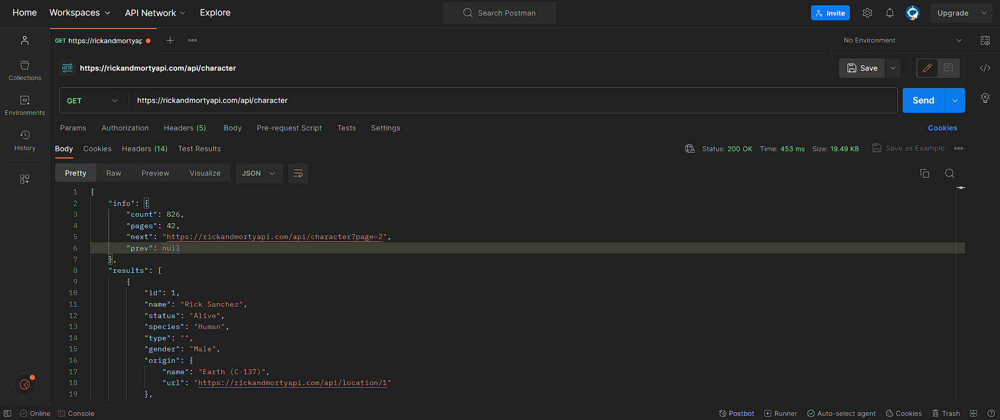
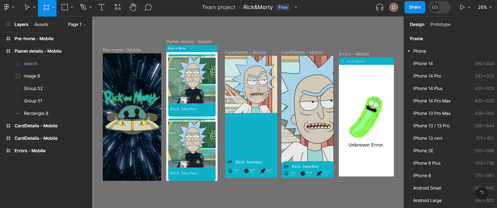
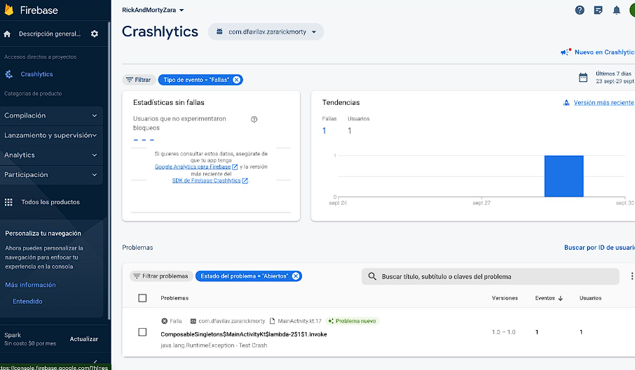
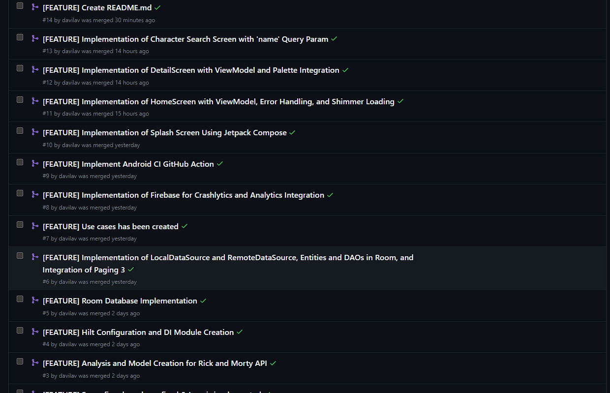
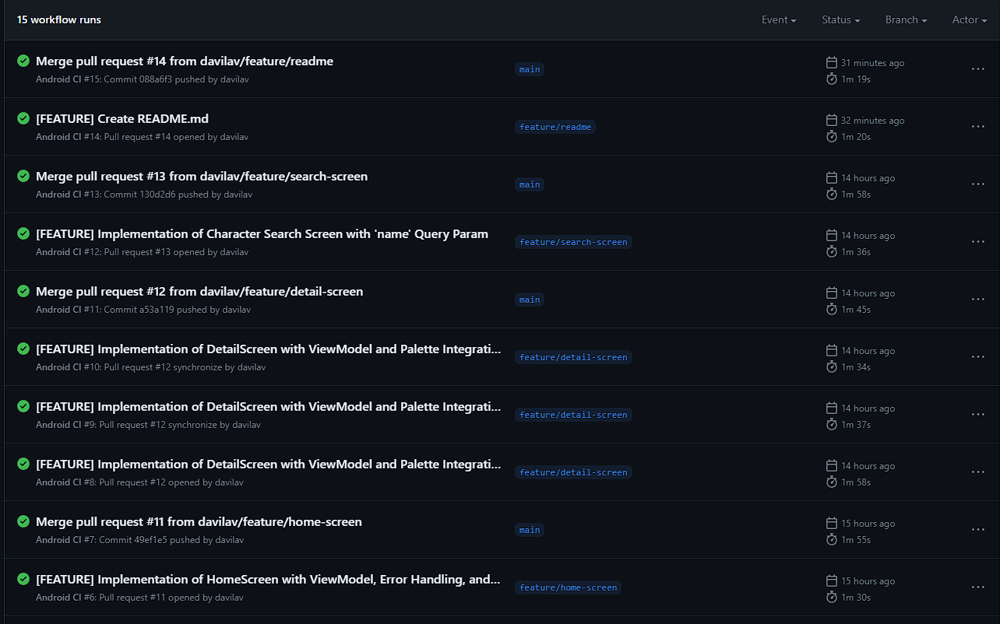

# Challenge de Zara para Android: Rick&MortyApp

Este repositorio contiene un proyecto Android que da solución al reto propuesto por Zara para la plataforma Android. En esta documentación se encontrará todo lo relacionado al análisis, diseño y solución propuesto para el desarrollo de esta aplicación móvil.

El objetivo del proyecto es demostrar las mejores prácticas, proporcionar un conjunto de directrices y presentar una arquitectura moderna de aplicaciones Android que sea modular, escalable y mantenible.

| Rick&MortyApp              |
|----------------------------|

https://github.com/davilav/RickAndMorty/assets/45363395/b1575041-9ede-4051-bc8a-32113a685e8a


## Table of Contents

- [Análisis](#análisis)
    - [Estructura de la API de github](#estructura-de-la-api-de-Github)
    - [Diseño de las pantallas](#diseño-de-las-pantallas)
    - [Funcionalidades](#funcionalidades)
- [UI](#ui)
- [Arquitectura](#arquitectura)
    - [Módulos](#módulos)
        - [Módulo App](#módulo-app)
        - [Módulo de data](#módulo-del-data)
        - [Módulo de dominio](#módulo-de-dominio)
    - [Componentes de Arquitectura](#componentes-de-arquitectura)
    - [Suite de Firebase](#suite-de-firebase)
- [Stack técnico](#stack-técnico)
    - [Integración continua](#integración-continua)
    - [Análisis de código](#análisis-de-código)
    - [Dependencias](#dependencias)
    - [Dependencias de test](#dependencias-de-test)
    - [Plugins](#plugins)
- [License](#license)

## Análisis

### Estructura de la API en https://rickandmortyapi.com/

Se accedió por medio de postman a crear una coleccion para probar la api proporcionada en la prueba tecnica, esto sirve para conocer la estructura de los servicios, peticiones, cabeceras:



Información General:

Esta API proporciona datos relacionados con el programa de televisión "Rick and Morty". La información está organizada en forma de personajes de la serie.
Información de la Respuesta:

El objeto principal de la respuesta se encuentra dentro de llaves {}.
Objeto "info":

Contiene información meta sobre la respuesta de la API.
"count": Indica la cantidad total de personajes disponibles en la API.
"pages":Indica el número total de páginas disponibles para mostrar los personajes. Esto sugiere que hay 42 páginas de personajes en total.
"next": Un enlace (URL) que proporciona la dirección de la siguiente página de resultados. En este caso, dirige a la página 2 de la lista de personajes.
"prev": Es nulo, lo que sugiere que esta es la primera página de resultados y no hay una página previa.
Arreglo "results":

Contiene una lista de objetos que representan a los personajes de la serie.
No se proporciona información específica sobre los personajes en el fragmento proporcionado. Se espera que cada objeto dentro de esta lista contenga detalles sobre un personaje, como su nombre, género, especie, etc.
En resumen, esta API proporciona información sobre personajes de la serie "Rick and Morty". La respuesta incluye datos meta sobre la cantidad de personajes disponibles y la paginación para acceder a más resultados. Cada objeto en la lista "results" representa un personaje de la serie con detalles específicos que se encontrarán en las páginas subsiguientes de la API.

### Diseño de las pantallas

Se implemento un MVP funcional que consta de las siguientes pantallas:

- **Pantalla de Splash**: Es la primera pantalla que los usuarios ven al iniciar la aplicación. Su principal función es mostrar un logotipo o una imagen de bienvenida durante unos segundos mientras la aplicación se carga o inicia.
- **Pantalla de Inicio**: Es la pantalla principal de la aplicación después de la pantalla de Splash. Aquí, los usuarios pueden ver una lista de personajes de la serie "Rick and Morty" obtenidos de la API. La lista de personajes podría mostrarse en forma de tarjetas o filas con imágenes y nombres de los personajes. Los usuarios pueden hacer clic o tocar en un personaje para acceder a la "Pantalla de Detalle" y obtener información más detallada sobre ese personaje.
- **Pantalla de Detalle**: Es la pantalla que muestra información detallada sobre un personaje seleccionado de la lista en la "Pantalla de Inicio". Puede mostrar la imagen del personaje, su nombre, género, especie, origen y otros datos relevantes.
- **Pantalla de Búsqueda**: Es la pantalla que permite a los usuarios buscar personajes específicos de la serie "Rick and Morty" utilizando un campo de búsqueda. Los usuarios pueden ingresar el nombre o una palabra clave relacionada con el personaje que desean encontrar. La aplicación enviará la solicitud a la API utilizando los términos de búsqueda y mostrará los resultados coincidentes en la "Pantalla de Inicio" o en una nueva pantalla de resultados de búsqueda.

### Funcionalidades
El objetivo del desarrollo de este ejercicio es implementar una aplicación que sea:

- **Escalable**: Adoptar la suite de Firebase para lograr obtener información del uso de la aplicación que permitan conocer los detalles más importantes que permiten una escalabilidad oportuna.
- **Usable**: Adoptar guías de estilo de Material Design para que la aplicación luzca una interfaz moderna.
- **Mantenible**: Adoptar guías de modularización para lograr que la aplicación sea lo menos acoplada posible y se pueda realizar un mantenimiento más efectivo.

## UI

En el proceso de desarrollo de una aplicación inspirada en la serie "Rick and Morty", es esencial comenzar con un diseño sólido que sirva como una hoja de ruta visual para el proyecto. Figma es una herramienta popular para este propósito debido a su capacidad de colaboración y su conjunto de herramientas de diseño versátiles. A continuación, se explica cómo se creó un diseño en Figma:

- **Investigación y conceptualización**: El primer paso consiste en investigar la serie "Rick and Morty" y comprender su estética, personajes, tramas y elementos visuales clave. Esto incluye ver episodios, analizar diseños de personajes y entornos, y comprender la esencia del programa.
  

[FIGMA](https://www.figma.com/file/po68H4WnwtNz4PDwYptlGS/Rick%26Morty?type=design&node-id=230%3A8&mode=design&t=TUQiLlwhMRUXRMX0-1)


## Arquitectura

La arquitectura de la aplicación se basa, aplica y cumple estrictamente con cada uno de los siguientes 5 puntos:

-   [Android architecture components](https://developer.android.com/topic/libraries/architecture/), parte de Android Jetpack para dar a proyectar un diseño robusto, testeable y mantenible.
-   Patron [Model-View-ViewModel](https://en.wikipedia.org/wiki/Model%E2%80%93view%E2%80%93viewmodel) (MVVM) facilita una [separación](https://en.wikipedia.org/wiki/Separation_of_concerns) de desarrollo de la interfaz gráfica de usuario y la logica de negocio.

### Componentes de Arquitectura

Idealmente, los ViewModels no deberían saber nada de Android. Esto mejora la testabilidad, la seguridad de las fugas y la modularidad. Los ViewModels tienen alcances diferentes a los de las actividades o fragmentos. Mientras un ViewModel está vivo y funcionando, una actividad puede estar en cualquiera de sus estados del ciclo de vida. Las actividades y los fragmentos pueden ser destruidos y creados de nuevo mientras el ViewModel no es consciente.

Pasar una referencia de la Vista (actividad o fragmento) al ViewModel es un riesgo serio. Supongamos que el ViewModel solicita datos de la red y los datos vuelven algún tiempo después. En ese momento, la referencia de la Vista podría ser destruida o podría ser una actividad antigua que ya no es visible, generando una fuga de memoria y, posiblemente, un crash.

La comunicación entre las diferentes capas sigue el diagrama anterior utilizando el paradigma reactivo, observando los cambios en los componentes sin necesidad de callbacks evitando fugas y casos de borde relacionados con ellos.

También la seguridad es un factor muy importante en cualquier aplicación móvil y es por esta razón que se implementa la libreria de seguridad de Android Jetpack para encriptar las preferencias compartidas donde se almacenan datos que deben persistir en la vida de la aplicación . 

### Suite de Firebase

Se implementa este proyecto en Firebase para el manejo principalmente:

- **Rendimiento:** Se utiliza Firebase Perfomance para medir el rendimiento de la aplicación.
- **Errores y fallos:** Se utiliza Firebase Crashlytics para el monitoreo de errores y fallos.
- **Analiticas:** Se utiliza Firebase Analytics para visualizar todos los evento marcados que ayuden a entender el comportamiento que tiene la app frente a los usuarios.
  

## Stack técnico

### Integración continua

Este proyecto está alojado en el repositorio Github el cual permite realiza un proceso de desarrollo basado en integración continua mediante la ejecución de un pipeline que verifica la compilación correcta de la aplicación antes de ser mezclado a la rama principal.

- **Ramas por funcionalidad o  característica**: Por cada nueva funcionalidad o característica se crea una rama partiendo de master.

```
feature/domain-module-creation
```
- **Pull Request**: Luego que se realiza un push de esa rama de característica, se crea un pull request encargado de esperar que los desarrolladores participante aprueben el cambio, este modulo dispara automáticamente el pipeline.
  
- **Pipeline**: Verifica la compilación correcta de la aplicación mediante la descarga de gradle y ejecuta las tareas de construcción, ktlint y test.
  

### Análisis de código

| Plugin  | Check command
|--------|------------:|---------------|-------------|
| [detekt](https://detekt.dev/) | `./gradlew detekt`
| [lint](https://developer.android.com/studio/write/lint) | `./gradlew lint`

### Dependencias

Este proyecto aprovecha muchas bibliotecas, plugins y herramientas populares del ecosistema Android. La mayoría de las bibliotecas están en la versión estable, a menos que haya una buena razón para utilizar la dependencia no estable.

- Kotlin
- Kotlin DSL
- Gradle KTS
- Jetpack:
    - Android KTX
    - AndroidX
    - View Binding
    - Compose
    - Lifecycle
    - LiveData
    - ViewModel
    - Navigation
    - Paging 3
    - Room
    - Hilt
- Material
- Coroutines
- Retrofit2
- Gson


### Dependencias de test

- Espresso
- JUnit
- Mockk
- AndroidX Test

### Plugins

-   detekt

### License
```

Licensed under the Apache License, Version 2.0 (the "License");
you may not use this file except in compliance with the License.
You may obtain a copy of the License at

    http://www.apache.org/licenses/LICENSE-2.0

Unless required by applicable law or agreed to in writing, software
distributed under the License is distributed on an "AS IS" BASIS,
WITHOUT WARRANTIES OR CONDITIONS OF ANY KIND, either express or implied.
See the License for the specific language governing permissions and
limitations under the License.
